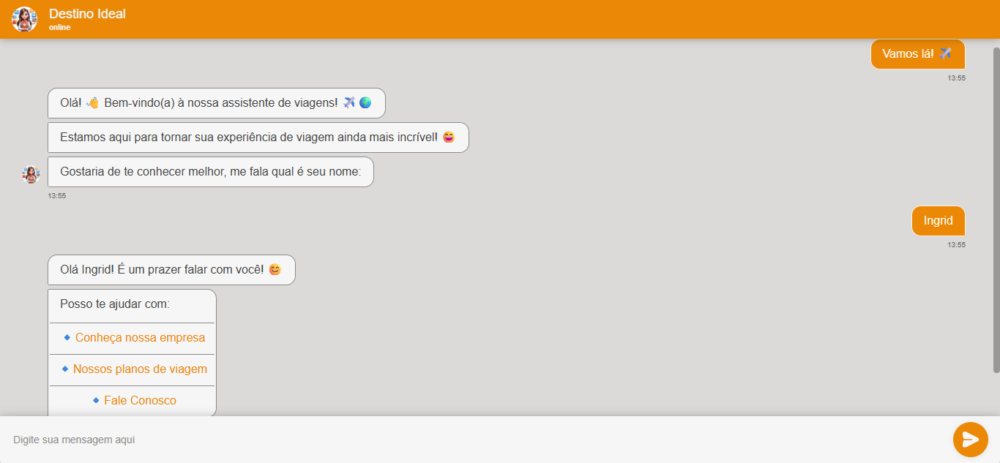
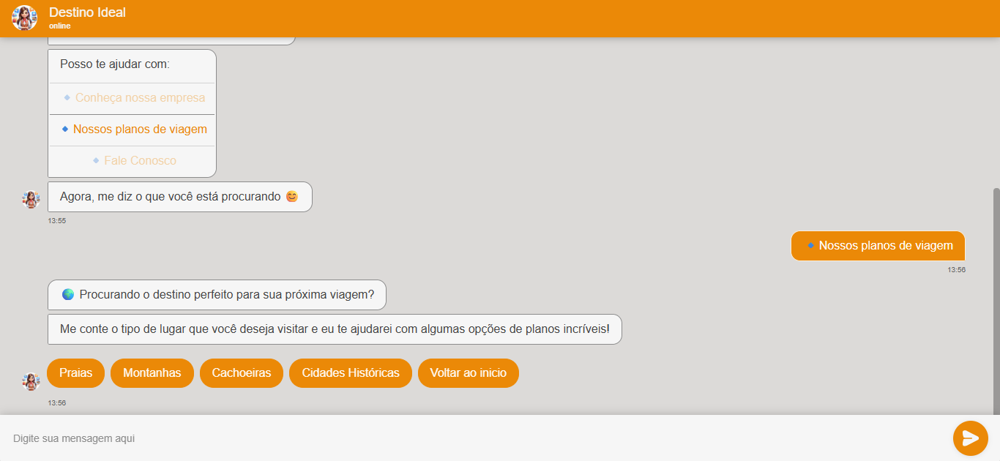
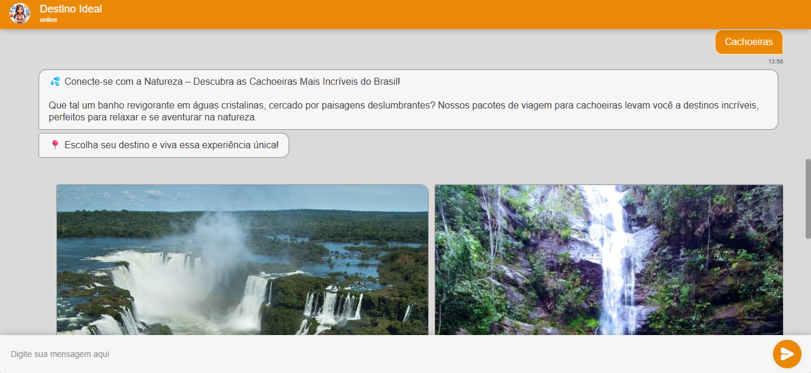
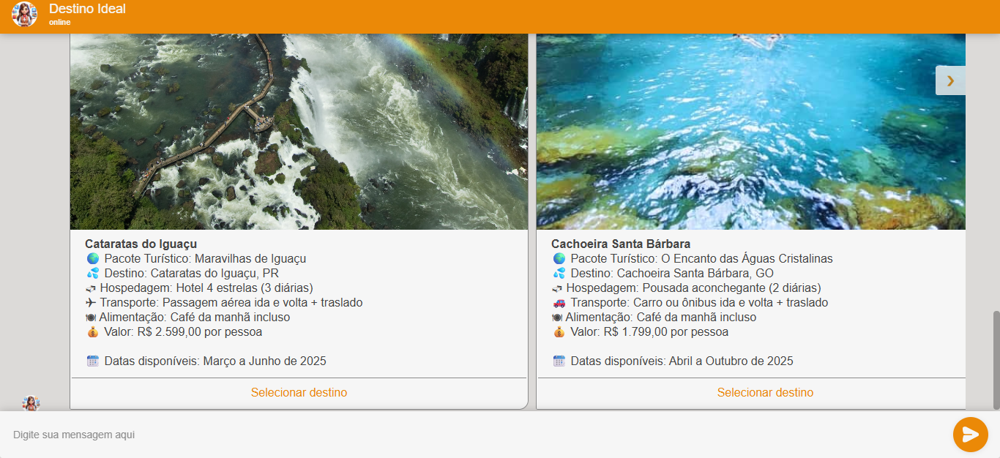
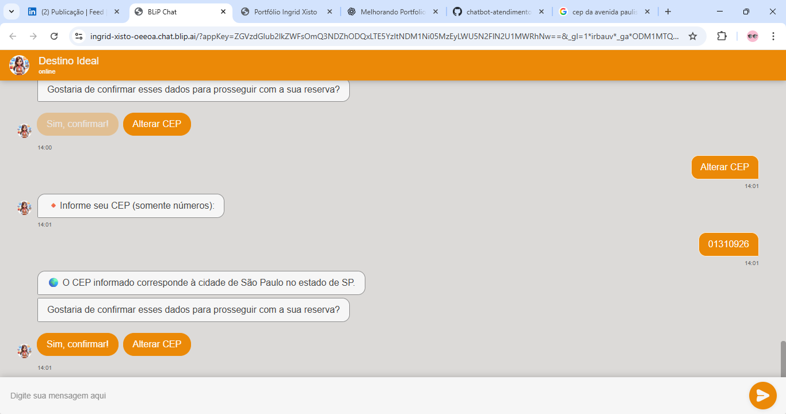
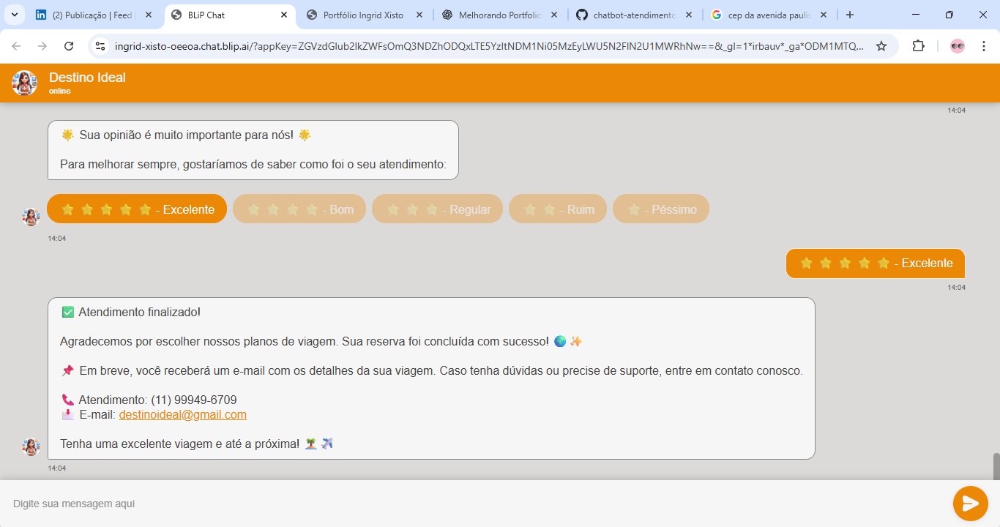
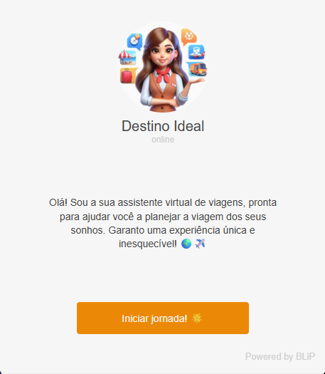

# 🤖 Chatbot de Atendimento para Viagens

## 📌 Visão Geral
Projeto prático de chatbot de atendimento desenvolvido na plataforma **BLiP**, com foco em **experiência do usuário (UX)** e **organização de fluxos conversacionais**.

O chatbot permite que o usuário explore destinos de viagem de forma interativa, conheça planos disponíveis, acesse informações institucionais e entre em contato com a empresa, simulando um cenário real de atendimento automatizado.

---

## 🎯 Objetivo do Projeto
- Automatizar o atendimento inicial ao usuário
- Organizar fluxos de conversa de forma intuitiva
- Melhorar a experiência do usuário em canais conversacionais
- Aplicar conceitos práticos de chatbot, APIs e automação

---

## 🧩 Funcionalidades
- Seleção de destinos por meio de **cards interativos**
- Apresentação de planos de viagem:
  - Montanhas  
  - Praias  
  - Cachoeiras  
  - Cidades históricas
- Uso de **variáveis** para controle de estado da conversa
- Fluxos guiados por **Quick Replies**
- Integração com **API externa (ViaCEP)** para validação de endereço
- Acesso a informações institucionais
- Opção de contato direto com a empresa

---

## 🛠 Tecnologias e Ferramentas Utilizadas
- BLiP (plataforma de chatbot)
- Lógica de fluxos conversacionais
- Variáveis e controle de estado
- Integração com API REST (ViaCEP)
- Testes de requisições com **Postman**
- Conceitos de UX e design conversacional

---

## 🔄 Fluxo de Funcionamento
1. Usuário inicia a conversa
2. Seleciona o destino desejado via carrossel
3. Visualiza planos disponíveis
4. Interage por meio de respostas rápidas
5. Chatbot mantém o contexto da conversa
6. Validação de endereço via API externa
7. Encerramento ou redirecionamento para contato

---

### 🟢 Início da Conversa
Tela inicial do chatbot, apresentando a mensagem de boas-vindas e orientando o usuário sobre as opções disponíveis.

### 🧭 Seleção de Destinos
Seleção de destinos disponíveis utilizando carrossel interativo.

### 🏖️ Planos de Viagem
Apresentação dos planos de viagem conforme o destino escolhido.

### 📍 Validação de CEP
Validação de endereço utilizando integração com a API ViaCEP.

### ❌ Tratamento de Erro
Tratamento de erro quando o usuário informa um CEP inválido.

### ✅ Encerramento da Conversa
Mensagem de encerramento do atendimento ao usuário.

> Imagens adicionais dos fluxos conversacionais desenvolvidos no Builder do BLiP estão disponíveis na pasta `/screenshots`.

---

## 🧠 Aprendizados
- Design e organização de fluxos conversacionais
- Controle de estado em chatbots
- Experiência do usuário aplicada a interfaces conversacionais
- Integração com APIs REST
- Testes de requisições com Postman
- Pensamento orientado à automação de processos

---

## 🎥 Demonstração
No vídeo do projeto é possível visualizar a interação completa com o chatbot, desde a escolha do destino até a navegação pelos fluxos.

> Clique na imagem para assistir à demonstração completa do chatbot no LinkedIn.

---

## 🔗 Acesso ao Chatbot
👉 https://lnkd.in/dP6tXEpw

---

## 🚀 Possíveis Evoluções Futuras
- Integração com backend em **Python (FastAPI/Flask)**
- Uso de **IA/NLP** para respostas inteligentes
- Registro de dados em banco de dados
- Análise de conversas e métricas de uso
- Integração com sistemas de CRM

---

## 👩‍💻 Autora
**Ingrid Xisto**  
Estudante de Análise e Desenvolvimento de Sistemas  
Foco em Python, APIs, Automação e Inteligência Artificial  

🔗 GitHub: https://github.com/Ingridxisto  
🔗 LinkedIn: https://www.linkedin.com/in/ingridxisto/
